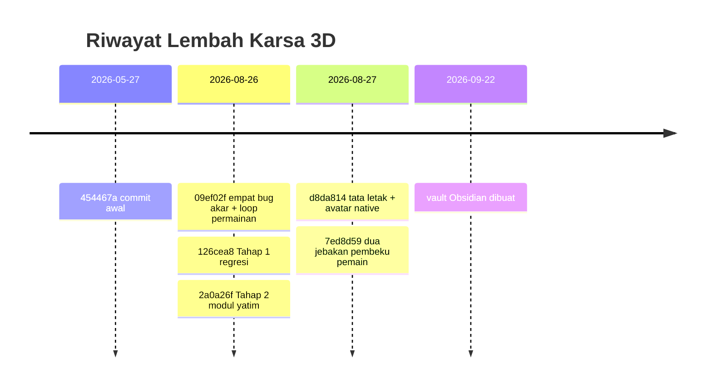

# Peta Progres

Urutan tahap diambil dari `docs/TAHAPAN.md`. Urutannya bukan selera: tiap tahap
membuka tahap berikutnya, dan tahap yang dilompati menagih ongkosnya belakangan.

| Tahap | Status | Inti | Catatan |
|---|---|---|---|
| 0 | ✅ selesai | amankan kerja di git | [[Tahap 0 — Amankan kerja]] |
| 1 | ✅ selesai | jaring pengaman regresi | [[Tahap 1 — Jaring pengaman]] |
| 2 | 🔨 jalan | verifikasi modul yang terlanjur ada | [[Tahap 2 — Verifikasi modul yatim]] |
| 3 | ⬜ belum | performa, 4–29 FPS | [[Tahap 3 — Performa]] |
| 4 | ⬜ belum | Wishes — alasan untuk peduli | [[Tahap 4 — Wishes]] |
| 5 | ⬜ belum | autonomi NPC | [[Tahap 5 — Autonomi]] |
| 6 | ⬜ belum | traits dan moodlets | [[Tahap 6 — Traits dan moodlets]] |
| 7 | ⬜ belum | misteri dan entitas | [[Tahap 7 — Misteri dan entitas]] |
| 8 | ⬜ belum | audio | [[Tahap 8 — Audio]] |

## Garis waktu commit

## Yang TIDAK dikejar

**Open world ala The Sims 3.** 15 scene terpisah dengan frame rate segini
membuat itu lubang tanpa dasar. Yang dikejar cukup menghilangkan *rasa*
loading: transisi instan, kamera mempertahankan sudut, mendarat di tempat yang
masuk akal. Penyimpangan ini disengaja dan tidak akan diakui sebagai kesetaraan
dengan TS3.

## Lihat juga

[[Status Sekarang]] · [[Utang Teknis]] · [[Peta Kode]]
