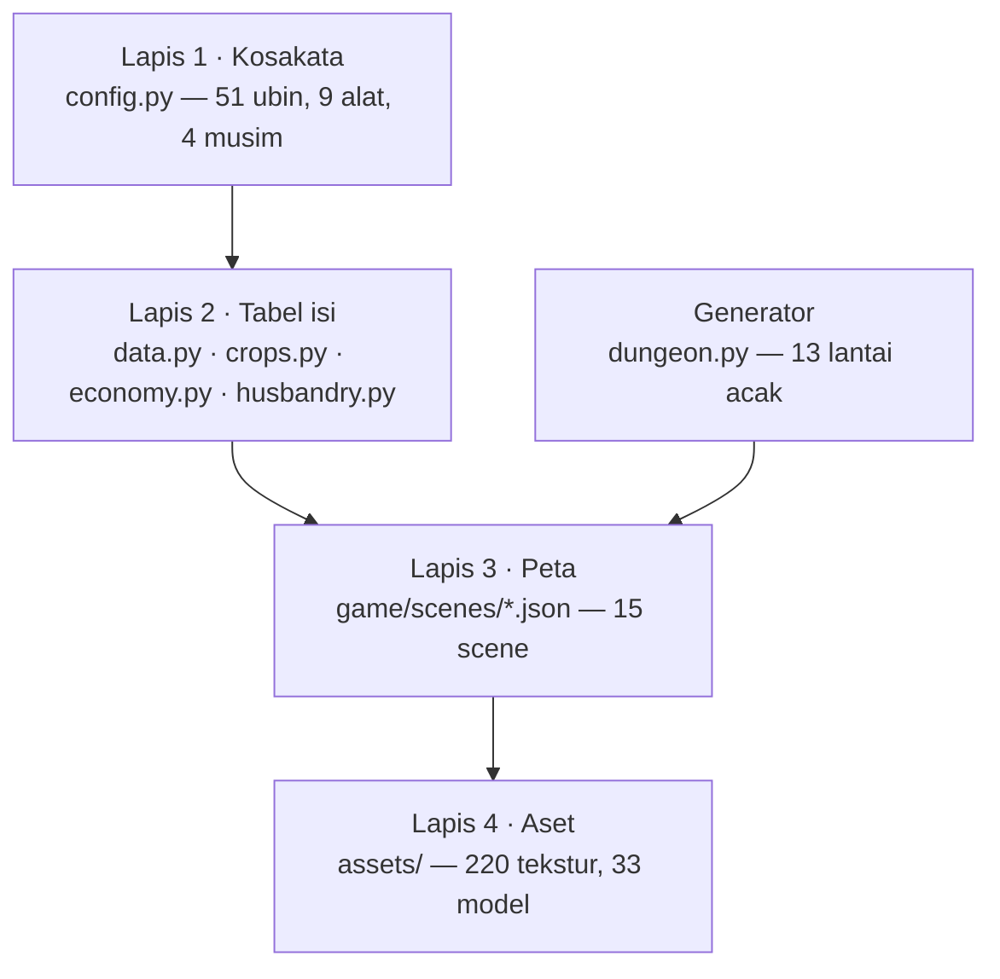
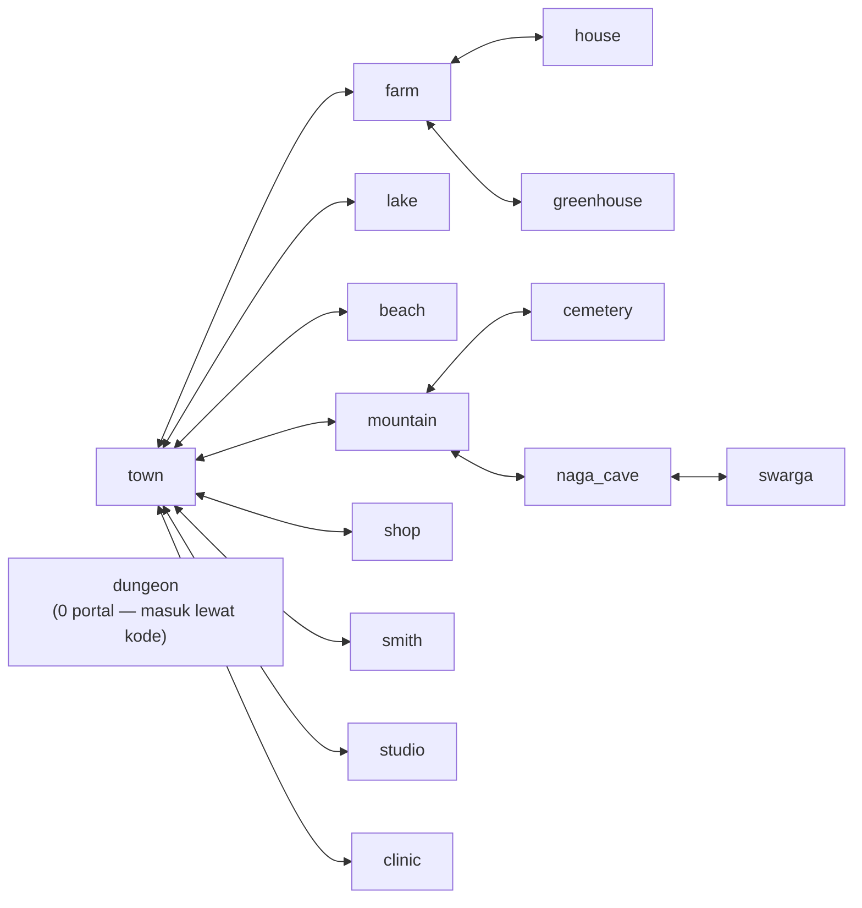
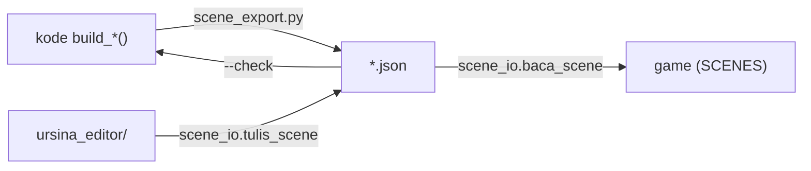

# Peta Sistem Konten

Nota ini memetakan **sistem konten**: dari mana isi dunia datang, dalam bentuk
apa ia disimpan, siapa yang boleh menulisnya, dan apa yang menjaga supaya dua
sumber kebenaran tidak menyimpang diam-diam. Bukan daftar modul — itu
[[Peta Kode]]. Bukan mekanika — itu [[Palawija]], [[Ekonomi]], [[Ternak]],
[[Dungeon dan Combat]].

Semua angka di bawah **diukur hari ini** (2026-10-07) dengan perintah yang
ikut dicantumkan, bukan dikutip dari dokumen lama.

## Empat lapis



Lapisnya berurutan: ubin dinamai di lapis 1, tabel isi memakai nama itu, peta
menyusun ubin jadi tempat, aset memberinya rupa. Dungeon adalah pengecualian —
ia tidak disimpan sebagai berkas, ia **dibangkitkan** tiap kali pemain turun.

## Lapis 1 — Kosakata (`game/config.py`, 125 baris)

| Isi | Jumlah |
|---|---:|
| `TILE_NAMES` / `TILE_IDS` — ubin bernama | 51 |
| `WALKABLE` | 15 |
| `BLOCKING` | 34 |
| `TILLABLE` | 2 |
| `MINEABLE` | 7 |
| `TOOLS` | 9 |
| `SEASONS` | 4 |

51 ubin inilah seluruh abjad dunia ini. Peta apa pun hanya boleh memakai huruf
dari daftar ini; `legend` di tiap berkas scene mencatat huruf mana yang dipakai.

## Lapis 2 — Tabel isi

### `data.py` (698 baris, murni data, nol impor rendering)

| Tabel | Ditulis tangan | Saat jalan | Catatan |
|---|---:|---:|---|
| `CROPS` | 8 | **24** | 16 sisanya datang dari `crops.py` |
| `CONSUMABLES` | 11 | **27** | idem |
| `WILD_ITEMS` | 7 | 7 | |
| `HUMAN_NPCS` | 14 | 14 | |
| `SUPERNATURAL_NPCS` | 13 | 13 | |
| `ANIMAL_NPCS` | 9 | 9 | |
| `SCHEDULES` | 36 | 36 | satu per NPC, **nol yang bolong** |
| `BRANCHING_DIALOGUES` | 22 | 22 | |
| `QUEST_STAGES` | 12 | 12 | |
| `SIDE_QUESTS` | 1 | 1 | |
| `LORE_ITEMS` | 6 | 6 | |
| `MINERALS` | 5 | 5 | |
| `PICKAXE_RECIPES` | 5 | 5 | |
| `SWORD_RECIPES` | 4 | 4 | |
| `MOB_TEMPLATES` | 7 | 7 | + `BHUTAKALA_BOSS` |
| `SEASONAL_EVENTS` | 4 | 4 | ⚠️ **nol pemanggil** — lihat temuan 2 |
| `SHOP_ITEMS` | 10 | 10 | diturunkan dari `CROPS` **saat impor** — lihat temuan 1 |

Dua kolom itu penting dan mudah terlewat: `CROPS` **ditulis** 8 entri tapi
**berisi** 24 saat program jalan, karena `crops.py:_install()` menyuntikkan
katalognya ke `data.CROPS` pada saat impor. Siapa pun yang membaca `data.py`
saja akan salah hitung.

```bash
python3 -c "import game.crops, game.data as d; print(len(d.CROPS), len(d.CONSUMABLES))"
# 24 27
```

### `crops.py` (633 baris) — katalog yang mendaftar sendiri

17 tanaman + 7 pohon = 24. Lima tahap untuk tanaman, empat untuk pohon.
Sebaran musim: Semi 13 · Panas 16 · Gugur 17 · Dingin 10.
Aturannya satu: **apa yang sudah ada di `data.py` tidak pernah ditimpa**, jadi
harga yang ditulis tangan di sana selalu menang. → [[Palawija]]

### `economy.py` (388 baris) — harga dan olahan

78 item punya harga jual dan nama tampil, keduanya **diturunkan** dari `CROPS`
+ tabel hasil ternak + `MINERALS`, bukan ditulis dua kali. 12 resep olahan,
5 spesies ternak berproduksi, 6 jenis pakan, `SHIPPING_RATE` 0,85. → [[Ekonomi]]

### `husbandry.py` (434 baris) — perawatan harian

4 spesies punya pengali susut sendiri (`ayam`, `kelinci`, `kucing`, `sapi`).
→ [[Ternak]]

### `objects.py` (311 baris) — perabot

15 jenis objek, 16 entri interaksi, **20 interaksi** total. → [[Objek dan Interaksi]]

## Lapis 3 — Peta sebagai data (`game/scenes/`)

Sejak "Fase 3" di base branch, scene adalah **berkas data**. `SCENES` dibangun
sekali saat impor: `<nama>.json` kalau ada dan sehat, kode `build_*()` kalau
tidak. Berkas rusak **tidak** membuat game mati — ia dilaporkan lalu dilewati.

| Scene | Tampil | Grid | Portal | Zona cat | Objek | Indoor |
|---|---|---|---:|---:|---:|---|
| `farm` | Kebun Paman Arsa | 28×20 | 4 | 4 | 3 | – |
| `town` | Desa Karsa | 30×25 | 12 | 0 | 0 | – |
| `mountain` | Lereng Gunung | 30×25 | 5 | 2 | 0 | – |
| `beach` | Pantai Selatan | 35×30 | 2 | 0 | 0 | – |
| `swarga` | Swarga (Dunia Langit) | 31×31 | 1 | 0 | 0 | – |
| `cemetery` | Kuburan Tua | 18×22 | 2 | 0 | 0 | – |
| `lake` | Danau Karsa | 18×14 | 2 | 0 | 0 | – |
| `naga_cave` | Gua Sang Hyang | 15×12 | 2 | 6 | 0 | ya |
| `greenhouse` | Rumah Kaca | 15×12 | 1 | 0 | 0 | ya |
| `house` | Rumah Kamu | 15×6 | 1 | 0 | 0 | ya |
| `shop` | Warung Bu Sari | 15×6 | 1 | 0 | 0 | ya |
| `smith` | Bengkel Budi | 15×6 | 1 | 0 | 0 | ya |
| `studio` | Studio Maya | 15×6 | 1 | 0 | 0 | ya |
| `clinic` | Klinik Pak Raka | 15×6 | 1 | 0 | 0 | ya |
| `dungeon` | Gua Bertingkat | 24×18 | 0 | 0 | 0 | ya |

**5.961 sel ubin · 36 portal · 12 zona cat · 3 objek terpasang · 26,3 KB.**

Angka "3 objek" itu bukan salah ketik: isi visual scene hampir seluruhnya
**diturunkan dari grid ubin** oleh `scenes/props.py`, bukan disimpan sebagai
daftar objek. Lapisan objek terpasang masih bayi — satu kursi, satu pot, satu
jam, semuanya di `farm`. → [[Tata Letak Scene]]

### Jaringan portal



`town` adalah simpul pusat (12 dari 36 portal). Setiap portal punya balikannya
— **nol portal satu arah**, dan nol portal menunjuk scene yang tidak ada.
`dungeon` satu-satunya scene tanpa portal: ia dimasuki dari kode
(`player.py:1140`), bukan dari data.

```bash
python3 - <<'P'
import json,pathlib,collections
e=collections.Counter()
for p in pathlib.Path('game/scenes').glob('*.json'):
    for prt in json.loads(p.read_text(encoding='utf-8-sig')).get('portals') or []:
        e[(p.stem, prt[2])]+=1
print(sum(e.values()), 'portal;', [k for k in e if (k[1],k[0]) not in e], 'satu arah')
P
# 36 portal; [] satu arah
```

### Jadwal NPC vs peta

36 NPC, 36 jadwal, **nol NPC tanpa jadwal dan nol jadwal tanpa NPC**. Jadwal
menyebut 13 scene nyata plus satu nama yang bukan scene: `hidden`, dipakai 17
baris oleh 10 makhluk malam dengan koordinat `(-1, -1)`.

Itu **idiom, bukan bug**: `entities.py:157` membandingkan nama scene dengan
kesetaraan, jadi `hidden` tidak pernah cocok dan NPC-nya tidak dimunculkan.
Yang perlu dicatat jujur: tidak ada satu baris pun yang *memeriksa* `hidden`.
Ia bekerja karena perbandingannya kebetulan gagal, bukan karena ada aturan.

## Lapis 4 — Aset (`assets/`)

| Folder | Berkas |
|---|---:|
| `textures/` | 220 |
| `models/` | 33 |
| `fonts/` | 1 |

- **Tekstur ubin/objek**: `world.TILE_TEX` + `OBJ_TEX` menyebut 35 nama,
  **semuanya ada di disk** (nol hilang). Ini layak diperiksa karena
  `world._tex()` mengembalikan `None` tanpa bunyi kalau berkasnya tidak ada —
  tekstur hilang muncul sebagai permukaan polos, bukan sebagai error.
- **185 tekstur lain** tidak disebut dua tabel itu; pemakainya
  `scenes/props.py` (paket bergaya TSO: `adobetile*`, `asphaltshingle*`).
- **Model**: hanya **5 dari 33** yang benar-benar diminta kode —
  `humanoid`, `naga`, `mob_genderuwo`, `mob_kelelawar`, `mob_pocong`
  (lewat `entities.get_npc_model_name`). 25 sisanya belum punya pemuat →
  temuan 4.
- Font HUD punya riwayatnya sendiri → [[Font HUD tidak ketemu di mesin bersih]].

## Generator — `dungeon.py` (185 baris)

Dungeon bukan berkas; ia dibangkitkan per lantai dengan cellular automata.
13 lantai (`DUNGEON_MAX_LEVEL`), grid 24×18, 7 jenis mob + 1 bos, dan
`ORE_SPAWN_TABLE` berisi bobot ore per lantai. → [[Dungeon dan Combat]]

## Loop pengarang: kode ⇄ data ⇄ editor



| Alat | Perannya | Dijalankan oleh |
|---|---|---|
| `tools/scene_export.py` | turunkan JSON dari kode | manual |
| `tools/scene_export.py --check` | **detektor penyimpangan** kode vs data | ⚠️ tidak ada — temuan 5 |
| `tools/scene_roundtrip.py` | buktikan `Scene` bolak-balik lewat JSON utuh | manual |
| `game/scenes/scene_io.py` | satu-satunya bentuk teks berkas scene | game **dan** editor |
| `ursina_editor/` | editor peta yang bisa **menulis** scene | manusia |
| `karsa_level_editor.py` | editor terpisah — **tidak bisa menyimpan** (temuan 8) | manusia |

Editor memakai `scene_io` milik game, bukan pembaca sendiri. Itu keputusan yang
sengaja dan alasannya ditulis di `ursina_editor/karsa_scene.py`: dua
implementasi format akan berbeda diam-diam, dan perbedaannya muncul sebagai
diff raksasa tiap kali editor menyimpan walau isinya tidak berubah.

Satu hal yang tidak dilakukan loop ini: **game tidak pernah menulis scene**.
Menebang pohon dan menambang ore hanya mengubah salinan di memori, jadi
perubahannya hilang saat program ditutup. Itu perilaku lama yang sengaja
dibiarkan.

### Dijalankan hari ini

```
python3 tools/scene_export.py --check    15/15 scene identik dengan kode   exit 0
python3 tools/scene_roundtrip.py         15/15 scene bolak-balik utuh      exit 0
```

Kode dan data **tidak** menyimpang hari ini. Yang belum ada adalah yang
menjaga keadaan itu besok.

## Sensus konten

| Golongan | Jumlah |
|---|---:|
| Ubin bernama | 51 |
| Scene | 15 (5.961 sel, 36 portal) |
| Tanaman + pohon | 24 (17 + 7) |
| NPC | 36 (14 manusia, 13 gaib, 9 hewan) |
| Jadwal NPC | 36 |
| Pohon dialog bercabang | 22 |
| Tahap quest utama + sampingan | 12 + 1 |
| Item berlore | 6 |
| Item berharga (jual/nama) | 78 |
| Resep (pickaxe/pedang/olahan) | 5 + 4 + 12 |
| Mob + bos | 7 + 1 |
| Lantai dungeon | 13 |
| Perabot + interaksi | 15 + 20 |
| Festival musiman | 4 (nol terpakai) |

## Temuan

Semuanya diperiksa hari ini; perintahnya ikut ditulis supaya bisa dibantah.

### 1. 🟠 16 dari 24 benih tidak bisa dibeli, padahal syaratnya sudah terpenuhi

`crops.py:335 seed_shop_rows()` menyiapkan 16 baris toko untuk tanaman dan
pohon baru, dan **sengaja tidak memasangnya**. Alasan yang ditulis di sana:
panel toko memilih barang dengan tombol 1–9, jadi 16 baris tambahan akan
membuat sebagian besar tidak bisa dipilih.

Alasan itu **sudah tidak berlaku**: `panels.py:861 _page_slice()` membuat panel
toko berhalaman dengan `ROWS_PER_PAGE`, dan dipakai baik untuk menampilkan
(`:879`) maupun untuk membeli (`:950`). Syarat yang ditunggu `crops.py` sudah
ada; yang belum terjadi adalah pemasangannya.

Akibatnya 24 tanaman punya mekanika lengkap sementara `SHOP_ITEMS` tetap 10
baris — 8 benih + jerami + kayu. Inventaris awal hanya `lobak_seed` ×3
(`state.py:44`), dan tidak ada jalur lain untuk mendapat benih.

```bash
grep -rn "SEED_SHOP_ROWS" --include=*.py . | grep -v obsidian
# hanya definisinya sendiri di game/crops.py — nol pemanggil
python3 -c "import game.crops, game.data as d; print(len(d.SHOP_ITEMS), len(d.CROPS))"
# 10 24
```

### 2. 🟡 `SEASONAL_EVENTS` — empat festival yang tidak pernah dibaca

```bash
grep -rn "SEASONAL_EVENTS" --include=*.py . | grep -v obsidian
# hanya game/data.py:523 — definisinya
```

Empat festival (Festival Tanam, Malam Api Unggun, Hari Arwah, Malam Terpanjang),
masing-masing dengan hari, scene, dan deskripsinya. Nol pemanggil.
`docs/CODE_MAP.md:769` sudah mencatatnya; nota ini mengkonfirmasi masih begitu.

### 3. 🟡 Dua baris `ORE_SPAWN_TABLE` tidak bisa dicapai, dan angka 13 ditulis dua kali

`ORE_SPAWN_TABLE` punya 15 baris, tapi `DUNGEON_MAX_LEVEL = 13` dan
`random_stairs_chance()` menutup turunan di lantai 13 — baris 14 dan 15
mati. Lebih rapuh: `interaction_controller.py:190` dan `:336` menulis `== 13`
sebagai angka, bukan memakai `DUNGEON_MAX_LEVEL`. Kalau lantai maksimum
diubah, danau legendaris diam-diam tertinggal di lantai 13.

### 4. 🟡 25 dari 33 berkas model tidak punya pemuat

24 `au-*.glb` (12 warna × idle/walk) dan `sari_idle.glb` tidak pernah diminta.
`entities.load_model_file()` hanya dipanggil dengan nama dari
`get_npc_model_name()` — 5 nama. `au-*` muncul di `chargen.py` **hanya sebagai
sumber palet warna baju**, bukan sebagai model.

```bash
grep -rn "load_model_file" --include=*.py game | grep -v "def "
# entities.py:320, :326, :410, :415 — semuanya nama dari get_npc_model_name
```

### 5. 🟡 Detektor penyimpangan yang tidak dijalankan siapa pun

`scene_export.py --check` ada justru untuk menangkap kode dan data yang
berbeda. Tapi CI (`.github/workflows/regresi.yml`) hanya menjalankan
`tools/regress.py`, dan `regress.py` tidak menyebut `scene_export`. Jadi
penjaganya digantung tapi tidak dipasang — pola yang sama persis dengan
regresi sebelum 2026-09-22 → [[Regresi]].

### 6. 🟡 `docs/EKONOMI.md` dikutip dua kali, berkasnya tidak ada

`data.py:11` dan `economy.py:20` menyuruh pembaca ke `docs/EKONOMI.md` untuk
perhitungan harga per energi. Berkas itu tidak ada di `docs/`. Perhitungannya
sendiri masih terbaca di komentar `data.py`.

### 7. 🟡 `random_stairs_chance()` nol pemanggil

`dungeon.py:179`, satu-satunya fungsi di modul itu yang tidak dipakai.

### 8. ⚪ `karsa_level_editor.py` tidak bisa menyimpan

816 baris editor, `import json` di baris 10, dan **tidak satu pun**
`json.dump`/`json.load`/`scene_io` sesudahnya. Editor yang benar-benar bisa
menulis berkas scene adalah `ursina_editor/`. Dua editor, satu bisu.

## Yang TIDAK diperiksa

Supaya nota ini tidak dibaca lebih jauh dari buktinya:

- **Isi semantik tidak dinilai.** Yang diperiksa adalah tabel terbaca, jumlah,
  nama yang nyambung, dan pemanggil. Apakah harga `labu` adil atau dialog Arya
  masuk akal — tidak diperiksa.
- **Keterjangkauan jalur main belum diukur.** Nol portal satu arah bukan
  jaminan semua tempat bisa dicapai pemain; itu butuh probe yang benar-benar
  berjalan, bukan pembacaan data.
- **Tekstur di luar `TILE_TEX`/`OBJ_TEX` belum diaudit.** 185 berkas dipakai
  `props.py`; apakah semua yang disebut `props.py` ada di disk belum diperiksa.
- **Aset Vitaboy datang dari luar repo.** `vitaboy/tso_paths.py` mencari
  instalasi The Sims Online di jalur Windows absolut; di mesin ini tidak ada,
  jadi jalur itu tidak bisa diuji di sini → [[Avatar Vitaboy]].
- **Festival, benih yang belum terpasang, dan model tanpa pemuat** dilaporkan
  sebagai konten tanpa pemakai, **bukan** sebagai cacat visual. Tidak ada
  tangkapan layar yang membuktikan apa yang pemain lihat.

## Tautan

[[Peta Kode]] · [[Status Sekarang]] · [[Utang Teknis]] ·
[[Tata Letak Scene]] · [[Palawija]] · [[Ekonomi]] · [[Ternak]] ·
[[Objek dan Interaksi]] · [[Dungeon dan Combat]] · [[Regresi]]

Dokumen panjang yang nota ini **tunjuk**, tidak salin:
`docs/CODE_MAP.md` (880 baris, tabel per modul),
`docs/TATA_LETAK.md` (201, aturan tata letak scene).
